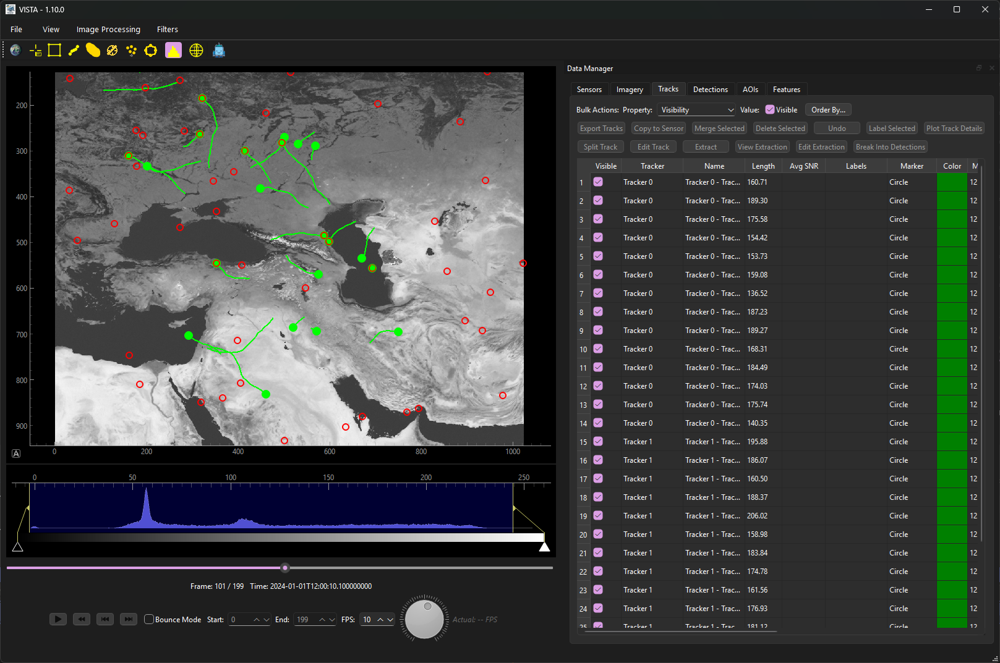

# VISTA - Visual Imagery Software Tool for Analysis
## An open-source MIT-licensed Awetomaton project for the GEOINT community


VISTA is a PyQt6-based desktop application for viewing, analyzing, and managing multi-frame imagery datasets along with associated detection and track overlays. It's designed for scientific and analytical workflows involving temporal image sequences with support for time-based and geodetic coordinate systems, sensor calibration data, and radiometric processing.


[](https://pypi.org/project/vista-imagery/)

**Documentation**: https://awetomaton.github.io/VISTA/

**Source Code**: https://github.com/awetomaton/VISTA

## Watch the Demo
[](https://www.youtube.com/watch?v=oDnTdtyQ7xw)

## Installation

```bash
pip install vista-imagery
```

Launch VISTA:
```bash
vista
```

Or install from source:
```bash
git clone https://github.com/awetomaton/VISTA.git
cd VISTA
pip install -e .
```

For detailed installation instructions, see the [Installation Guide](https://awetomaton.github.io/VISTA/1.12.3/getting_started/installation.html).

## Quick Start

1. **Load or simulate Imagery**:
 * (a) `File > Open` to load an HDF5 imagery file
 * (b) `File > Simulate` to simulate example data
2. **Navigate**: Use playback controls or arrow keys (Left/Right or A/D)
3. **Detect Objects**: `Algorithms > Detectors` to run CFAR or threshold detection
4. **Track Objects**: `Algorithms > Tracking` to link detections into tracks
5. **Export Results**: Export tracks/detections to CSV from the Data Manager

For a complete walkthrough, see the [Quick Start Guide](https://awetomaton.github.io/VISTA/1.12.3/getting_started/quickstart.html).

## Key Features

- **Multi-frame imagery viewing** with playback controls and histogram adjustment
- **View frame imagery in image or geodetic space** with tile servers to show imagery in geospatial context
- **Background removal**: Temporal median, Running sub-space tracker, Robust PCA, GoDec
- **Signal Enhancement**: Decimating or running Coaddition
- **Detection algorithms**: simple threshold detectors, CFAR, PSTNN
- **Tracking algorithms**: Simple, Kalman, Network Flow, and Tracklet trackers
- **Sensor calibration**: Bias removal, non-uniformity correction
- **Geodetic support**: Pixel-to-geodetic coordinate conversion
- **Manual annotation**: Create/edit/label tracks and detections interactively
- **Feature overlays**: AOIs, placemarks, and shapefile import

See the [User Guide](https://awetomaton.github.io/VISTA/1.12.3/user_guide/imagery.html) for detailed feature documentation.

## App Shortcuts

| Shortcut | Action |
|----------|--------|
| **Left Arrow** / **A** | Previous frame |
| **Right Arrow** / **D** | Next frame |
| **CTRL** + **Z** | Undo track / detection panel action |
| **Spacebar** | Play/Pause |
| **Delete** | Remove selected sensors, imagery, tracks, detectors, detection points |
| **Drag and Drop on Sensors / Imagery panels** | Load sensor / imagery data  |
| **Drag and Drop on Tracks Panels** | Load tracks data  |
| **Drag and Drop on Detections Panels** | Load detections data  |

## Input Data Formats

VISTA uses **HDF5** for imagery and **CSV** for tracks/detections. For format specifications, see:
- [Imagery HDF5 Format](https://awetomaton.github.io/VISTA/1.12.3/user_guide/imagery.html#hdf5-file-format)
- [Track CSV Format](https://awetomaton.github.io/VISTA/1.12.3/user_guide/tracks.html#csv-format)
- [Detection CSV Format](https://awetomaton.github.io/VISTA/1.12.3/user_guide/detections.html#export-to-csv)

## Programmatic Usage

```python
from vista.app import VistaApp
from vista.imagery.imagery import Imagery
import numpy as np

# Create imagery in memory
images = np.random.rand(10, 256, 256).astype(np.float32)
imagery = Imagery(name="Test", images=images, frames=np.arange(10))

# Launch VISTA
app = VistaApp(imagery=imagery)
app.exec()
```

See the [API Reference](https://awetomaton.github.io/VISTA/1.12.3/api/imagery.html) for complete programmatic documentation.

## Generating Test Data

Create simulated data via the GUI (`File > Simulate`) or programmatically:

```python
from vista.simulate.simulation import Simulation

sim = Simulation(name="Test", frames=50, rows=256, columns=256)
sim.simulate()
sim.save("test_data")
```

## Building an Executable

**Windows:**
```bash
pyinstaller vista/app.py --onefile -n vista --icon=vista/icons/logo.ico --hidden-import pyqtgraph.graphicsItems.PlotItem.plotConfigTemplate_pyqt6 --hidden-import pyqtgraph.imageview.ImageViewTemplate_pyqt6 --hidden-import pyqtgraph.graphicsItems.ViewBox.axisCtrlTemplate_pyqt6 --add-data="vista/icons*;vista" --add-data="vista/simulate/data*;vista"
```

**macOS/Linux:**
```bash
pyinstaller vista/app.py --onefile --windowed -n vista --icon=vista/icons/logo.icns --hidden-import pyqtgraph.graphicsItems.PlotItem.plotConfigTemplate_pyqt6 --hidden-import pyqtgraph.imageview.ImageViewTemplate_pyqt6 --hidden-import pyqtgraph.graphicsItems.ViewBox.axisCtrlTemplate_pyqt6 --add-data="vista/icons:vista/icons/" --add-data="vista/simulate/data:vista/simulate/data/"
```

## Contributing

Contributions are welcome! See the [Contributing Guide](https://awetomaton.github.io/VISTA/1.12.3/developer_guide/contributing.html) for details.

## License

MIT License

## Acknowledgments

VISTA uses PyQt6, pyqtgraph, NumPy, pandas, h5py, astropy, scikit-image, scipy, and other open-source libraries.
